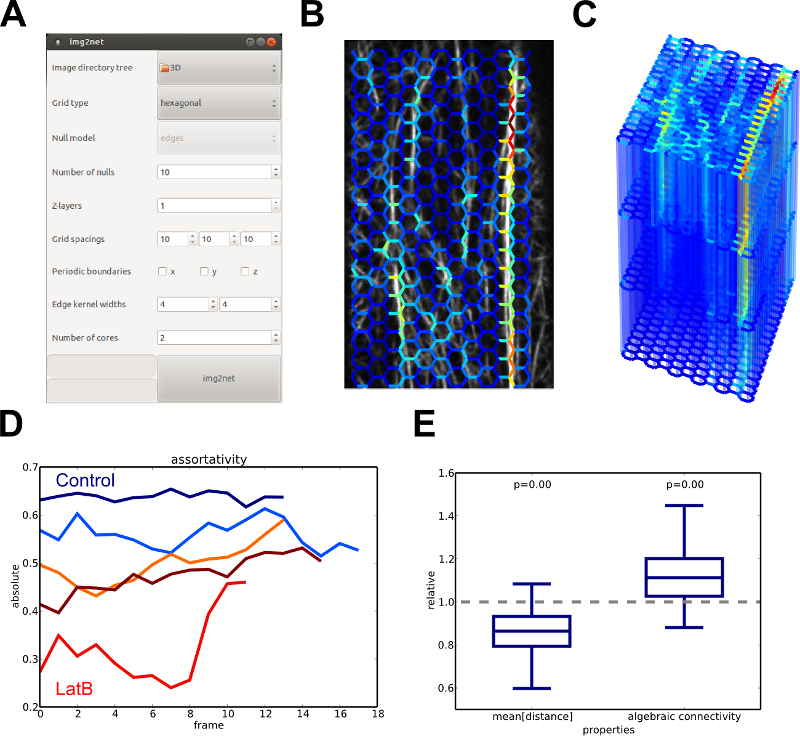

# img2net

**Automated network-based analysis of imaged phenotypes**

(A) GUI to set parameters for the network reconstruction.
(B) Actin network reconstructed with a hexagonal grid.
(C) 3D reconstruction for image data with four z-slices.
(D) Time series of the assortativity for multiple untreated (blue) and treated (red) plants.
(E) Ratios of average path lengths and algebraic connectivities of observed and null model networks.

Please see [project website for details](http://mathbiol.mpimp-golm.mpg.de/img2net/).

**Instructions**

Install package via:

- sudo pip2 install -e .

Run program via:

- run_img2net.py OR
- cd bin && python2 run_img2net.py

**Citation**

If this software is useful for your work, please include the following reference in your publication or redistribution:

Breuer et al. (2014) Quantitative analyses of the plant cytoskeleton reveal underlying organizational principles. J. R. Soc. Interface, 11(97): 20140362.
Breuer and Nikoloski (2014) img2net: Automated network-based analysis of imaged phenotypes. Bioinformatics, 30(22): 3291-3292.

